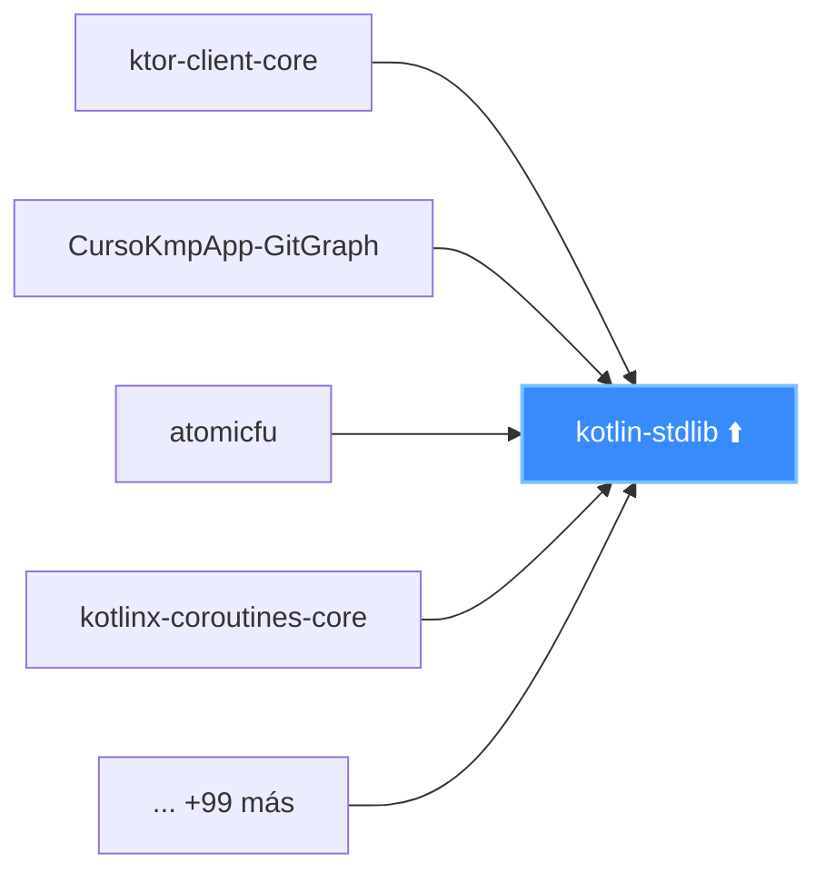

# CursoKmpApp-GitGraph

A Kotlin Multiplatform project targeting Android and iOS, used as the subject of an automated dependency analysis pipeline for a computer science thesis.

---

## Project Structure

```
CursoKmpApp-GitGraph/
├── composeApp/               — Shared KMP application code
│   ├── commonMain/           — Platform-agnostic logic
│   ├── androidMain/          — Android-specific code
│   └── iosMain/              — iOS-specific code
├── iosApp/                   — iOS entry point (SwiftUI)
└── pipeline/                 — Thesis analysis pipeline (independent from app)
    ├── sbom/                 — Step 1: retrieval  |  Step 2: transformation
    └── visualization/        — Step 3: arc diagram
```

Learn more about [Kotlin Multiplatform](https://www.jetbrains.com/help/kotlin-multiplatform-dev/get-started.html).

---

## Thesis Pipeline — Overview

This repository is both the **subject** and the **host** of an automated dependency analysis pipeline. The pipeline runs against its own source code, retrieving, transforming, and visualizing the project's complete dependency graph.

### Why dependency analysis?

Modern software projects, especially mobile ones, depend on dozens or hundreds of third-party libraries. Each library brings its own transitive dependencies, creating a complex directed graph that is invisible to developers during day-to-day work. Understanding this graph is valuable for:

- **Security**: identifying libraries with known vulnerabilities across the entire transitive closure
- **Maintenance**: detecting which libraries are most critical (many packages depend on them) so updates or breaking changes are prioritized correctly
- **Architecture**: revealing how different ecosystems (Kotlin, Compose, Ktor, AndroidX) connect within a single project

In a Kotlin Multiplatform project the graph is especially complex because the same logical library often resolves differently for each compilation target (JVM/Android vs. Kotlin/Native for iOS), producing a richer and denser graph than a single-platform project of the same size.

### Pipeline at a glance

```
GitHub Dependency Graph API
          │
          │  HTTP GET  (SPDX 2.3 JSON)
          ▼
    ┌─────────────┐
    │  Step 1     │  fetch_sbom.py / .sh / .js
    │  SBOM       │  → sbom.json
    │  Retrieval  │
    └──────┬──────┘
           │
           │  611 packages, 3 038 relationships
           ▼
    ┌─────────────┐
    │  Step 2     │  transform_sbom.js
    │  Graph      │  → graph.json
    │  Transform  │
    └──────┬──────┘
           │
           │  611 nodes, 3 037 directed edges
           ▼
    ┌─────────────┐
    │  Step 3     │  arc_diagram.html  (D3 v7)
    │  Arc        │  served via local HTTP server
    │  Diagram    │
    └─────────────┘
```

Each step is fully independent. The output of each step is a file on disk (`sbom.json` → `graph.json` → browser visualization), making the pipeline inspectable and resumable at any point.

---

## Step 1 — SBOM Retrieval

### What is a dependency?

A **dependency** is any external library that a project's build system must download and link in order to compile or run the application. In a Gradle-based Android/KMP project, dependencies are declared in `build.gradle.kts` files and resolved transitively: library A may depend on libraries B and C, which in turn depend on D, E, and F — none of which appear explicitly in the project's own build files. The complete set of all resolved dependencies (direct and transitive) can easily reach several hundred packages for a moderately complex mobile application.

### What is an SBOM?

A **Software Bill of Materials (SBOM)** is a machine-readable, standardized inventory of every software component in a project, including all transitive dependencies, their exact versions, their licenses, and the relationships between them. The concept comes from physical manufacturing (a bill of materials lists every part in a product); it was adapted to software following U.S. Executive Order 14028 (2021) on improving national cybersecurity, which mandated SBOMs for software sold to the U.S. government. The two dominant SBOM standards are:

| Standard | Maintained by | Format | Strengths |
|---|---|---|---|
| **SPDX 2.3** | Linux Foundation | JSON, RDF, tag-value | Mature, ISO standard, broad GitHub support |
| **CycloneDX** | OWASP | JSON, XML | Rich security metadata, VEX support |

This pipeline uses **SPDX 2.3** because GitHub's native Dependency Graph API produces SBOMs in this format. Using GitHub's own output avoids the need to run a separate SBOM generator (like Syft or cdxgen) and ensures the inventory reflects exactly what GitHub's dependency analysis engine resolved — the same data visible under *Insights → Dependency graph* in the repository UI.

### GitHub's Dependency Graph API

GitHub automatically analyzes every push to a repository and maintains a resolved dependency graph. This graph is accessible programmatically via:

```
GET https://api.github.com/repos/{owner}/{repo}/dependency-graph/sbom
```

For this repository:

```
GET https://api.github.com/repos/Sreys54/CursoKmpApp-GitGraph/dependency-graph/sbom
```

The response is a JSON object with a top-level `sbom` key wrapping a full SPDX 2.3 document. This wrapping is specific to the API endpoint; the raw export available through the GitHub UI does not have this extra key. The retrieval scripts handle both formats transparently.

### Why GitHub's API and not a local SBOM generator?

A local tool like **Syft** or **cdxgen** can also generate SBOMs, but they operate differently: they scan the file system and lock files without actually resolving the dependency graph through Gradle. GitHub's Dependency Graph, by contrast, runs the Gradle dependency resolution algorithm against the actual build files, producing the same resolved versions that would be downloaded during a real build. For the purposes of this thesis (analyzing the real runtime dependency graph of the project) GitHub's output is the authoritative source.

### Authentication

The API requires a Personal Access Token (PAT). Two types are supported:

| Token Type | Required Permission | Notes |
|---|---|---|
| Classic PAT | `repo` scope (private repos) or no scope (public) | Easier to set up |
| Fine-grained PAT | `dependency_graph: read` | More secure, recommended |

**Required request headers:**

```
Authorization: Bearer <YOUR_TOKEN>
Accept: application/vnd.github+json
X-GitHub-Api-Version: 2022-11-28
```

The `Accept` header specifies the GitHub API media type. The `X-GitHub-Api-Version` header pins the API version to prevent breaking changes from affecting the pipeline.

### Rate Limits

| Auth State | Limit |
|---|---|
| Unauthenticated | 60 requests/hour per IP |
| Authenticated (PAT) | 5,000 requests/hour per user |

The scripts log `X-RateLimit-Remaining` and `X-RateLimit-Reset` on every run. Since the SBOM is saved locally after each successful fetch, subsequent pipeline runs can skip the API call and use the cached file, consuming zero rate-limit quota.

### Prerequisites

1. Enable the Dependency Graph: repository → **Settings → Security → Dependency graph**.
2. Create a PAT at [github.com/settings/tokens](https://github.com/settings/tokens).
3. Set environment variables (see below).

### Files

```
pipeline/sbom/
├── fetch_sbom.py      — Python script (recommended)
├── fetch_sbom.sh      — curl/bash script
├── fetch_sbom.js      — Node.js script (zero npm dependencies)
├── .env.example       — Credentials template
└── requirements.txt   — Python dependency (requests)
```

> `sbom.json` and `.env` are excluded from git via `.gitignore`. They contain credentials and generated output respectively — neither should be version-controlled.

### Environment Variables

Copy `.env.example` to `.env` and fill in your values.

| Variable | Required | Description |
|---|---|---|
| `GITHUB_TOKEN` | Yes | Personal Access Token |
| `GITHUB_OWNER` | Yes | Repository owner (`Sreys54`) |
| `GITHUB_REPO` | Yes | Repository name (`CursoKmpApp-GitGraph`) |
| `SBOM_OUTPUT_PATH` | No | Output file path (default: `sbom.json`) |

### Option A — Python (recommended)

```bash
pip install -r pipeline/sbom/requirements.txt
cd pipeline/sbom
python fetch_sbom.py
```

| Function | Purpose |
|---|---|
| `load_config()` | Reads env vars; exits immediately with a clear message if any are missing |
| `build_headers()` | Constructs the three required GitHub API headers |
| `fetch_sbom()` | Makes the HTTP call, checks status code, validates response shape |
| `save_sbom()` | Writes pretty-printed JSON to `sbom.json` |
| `print_summary()` | Prints package count and a sample list to stdout |

### Option B — curl / bash

```bash
cd pipeline/sbom && bash fetch_sbom.sh
```

| Section | Purpose |
|---|---|
| `set -euo pipefail` | Exits immediately on any error, unset variable, or pipe failure |
| Variable validation loop | Checks all required env vars before making any network call |
| `curl --write-out "%{http_code}"` | Captures HTTP status separately from the response body |
| Status code checks | Specific messages for 403 (token/permissions) and 404 (wrong repo) |

### Option C — Node.js

```bash
cd pipeline/sbom && node fetch_sbom.js
```

Uses only built-in Node.js modules (`https`, `fs`) — zero npm dependencies.

### Error Handling

| HTTP Code | Cause | Message |
|---|---|---|
| 403 | Wrong token scope or Dependency Graph disabled | Check token scopes and repo settings |
| 404 | Wrong owner/repo name | Verify `GITHUB_OWNER` and `GITHUB_REPO` |
| Other | Network or API error | Raw response body is printed |

### Example Output

```
[INFO] Fetching SBOM from: https://api.github.com/repos/Sreys54/CursoKmpApp-GitGraph/dependency-graph/sbom
[INFO] Rate limit — remaining: 4998, resets at unix ts: 1742860800
[INFO] SBOM saved to 'sbom.json'

========== SBOM Summary ==========
  SPDX Version   : SPDX-2.3
  Total packages : 611
===================================
```

### Design Decisions — Step 1

| Decision | Reason |
|---|---|
| Separate `pipeline/` directory | Keeps thesis tooling fully isolated from the KMP application source. The app can be built and run without any pipeline files. |
| Three script implementations (Python, bash, Node.js) | Different CI environments have different tool availability. Python is best for local development; bash works in minimal Linux environments; Node.js enables future integration into a GitHub Actions workflow that already uses Node. |
| Environment variables only — no hardcoded values | Credentials must never appear in git history. Using env vars also makes the scripts portable across any repository without code changes. |
| `sbom.json` excluded from git | The SBOM is generated output, not source. It can always be regenerated with a single command. Committing it would cause noisy diffs on every dependency update and bloat the repository history. |
| Rate limit logged on every run | Makes throttling visible in CI logs before it becomes a problem, rather than failing silently with an empty response. |
| Specific 403/404 error messages | These are the two most common failure modes. A generic "HTTP error" message forces the developer to look up what 403 means in this context; the specific message eliminates that lookup. |

---

## Step 2 — SBOM to Graph Transformation

### The SPDX 2.3 Data Model

GitHub's SBOM uses the **SPDX 2.3** standard. The JSON document has two key arrays that map directly to the nodes and edges of a directed graph:

#### `packages` — the nodes

Every detected dependency is one entry in this array. The fields relevant to this pipeline are:

| Field | Description | Example |
|---|---|---|
| `SPDXID` | Opaque unique ID used internally to cross-reference relationships | `"SPDXRef-maven-org.jetbrains.kotlin-kotlin-stdlib-1.9.23-763561"` |
| `name` | Human-readable package identifier in Maven `group:artifact` format | `"org.jetbrains.kotlin:kotlin-stdlib"` |
| `versionInfo` | Exact resolved version string | `"1.9.23"` |
| `licenseConcluded` | SPDX license expression (may be absent for some packages) | `"Apache-2.0"` |
| `externalRefs` | Array of external references; the `purl` entry encodes the package URL | `"pkg:maven/org.jetbrains.kotlin/kotlin-stdlib@1.9.23"` |

This repository's SBOM contains **611 packages**.

#### `relationships` — the edges

Every directed dependency link between packages is one entry in this array:

| Field | Description |
|---|---|
| `spdxElementId` | The package **that has** the dependency (the dependent, the source of the arc) |
| `relatedSpdxElement` | The package **being depended on** (the dependency, the target of the arc) |
| `relationshipType` | `"DEPENDS_ON"` for all dependency edges. One `"DESCRIBES"` entry links the document root to the repo root package and must be ignored. |

This repository's SBOM contains **3,038 relationships**: 3,037 `DEPENDS_ON` edges and 1 `DESCRIBES` entry.

**A directed edge `A → B` means "A depends on B".**

This direction is critical for interpreting the visualization correctly. If you select library X and want to see "who uses X?", you are looking for all nodes `A` where the edge `A → X` exists — i.e., arcs pointing *to* X (incoming edges). If you want to see "what does X use?", you look for all nodes `B` where the edge `X → B` exists — i.e., arcs pointing *away from* X (outgoing edges).

### Why a directed graph?

The dependency relationship is asymmetric: if A depends on B, it does not follow that B depends on A. Using an undirected graph would lose this information, making it impossible to distinguish "X is used by 80 libraries" from "X uses 80 libraries" — two very different structural roles in the graph.

The pipeline preserves the direction throughout: from the SPDX `spdxElementId → relatedSpdxElement` pair, through the `source → target` encoding in `graph.json`, all the way to the arc direction in the visualization.

### The Transformation Pipeline

The script `transform_sbom.js` executes five sequential steps:

```
sbom.json  (raw SPDX 2.3)
    │
    ▼  Step 1 — Load & validate
    │  Parse JSON. If the GitHub API wrapper is present (top-level "sbom" key),
    │  unwrap it. Validate that "packages" and "relationships" arrays exist.
    │
    ▼  Step 2 — Build SPDXID → "name@version" index  (611 entries)
    │  Create a Map: SPDXID string → human-readable node ID.
    │  Node ID format: "name@version"  (e.g. "org.jetbrains.kotlin:kotlin-stdlib@1.9.23")
    │  This bridge is necessary because relationships reference packages
    │  by SPDXID, not by name.
    │
    ▼  Step 3 — Extract DEPENDS_ON edges  (3,037 links)
    │  For each relationship where type === "DEPENDS_ON":
    │    - Resolve both SPDXID values via the index
    │    - Drop self-loops (source === target)
    │    - Deduplicate via a Set keyed on "source||target"
    │    - Skip entries where either SPDXID is not in the index (warn)
    │
    ▼  Step 4 — Collect connected nodes  (611 nodes)
    │  Walk all extracted edges and collect every unique node ID that
    │  appears as source or target. This guarantees only connected
    │  nodes appear in the output (no isolated packages).
    │
    ▼  Step 5 — Write graph.json
       { "nodes": [...], "links": [...] }
```

### Output Format

```json
{
  "nodes": [
    { "id": "org.jetbrains.kotlin:kotlin-stdlib-common@1.9.23" },
    { "id": "org.jetbrains.kotlin:kotlin-stdlib@1.9.23" }
  ],
  "links": [
    {
      "source": "org.jetbrains.kotlin:kotlin-stdlib-common@1.9.23",
      "target": "org.jetbrains.kotlin:kotlin-stdlib@1.9.23"
    }
  ]
}
```

### Edge Cases Handled

| Case | Behavior | Reason |
|---|---|---|
| `DESCRIBES` relationship | Skipped | It is a document metadata entry linking the SPDX document root to the repo package — not a package-to-package dependency |
| SPDXID not found in the package index | Skipped with `[WARN]` log | GitHub occasionally includes relationships that reference packages omitted from the packages array; silent failure here would corrupt the graph |
| Package with no `name` field | Falls back to the SPDXID string | Prevents a crash; the SPDXID is still a unique and usable identifier |
| Package with no `versionInfo` | Node ID is just `name` (no `@version` suffix) | Version-less packages are rare but valid; excluding them would silently drop nodes |
| Self-loops (`source === target`) | Skipped silently | Meaningless in a dependency graph; would create visual artifacts (arcs with zero length) in the diagram |
| Duplicate edges (same source+target pair) | Deduplicated via a `Set` | The SBOM occasionally records the same dependency twice (once per compilation variant); duplicate edges would distort degree counts and visual arc density |
| API-wrapped SBOM (`{ "sbom": { ... } }`) | Auto-detected and unwrapped | The GitHub API endpoint adds this wrapper; the raw download from the UI does not — both formats must be supported without requiring the user to pre-process the file |

### Example Output

```
[INFO] SBOM loaded — 611 packages, 3038 relationships.
[INFO] Edges extracted — 3037 unique dependency links.
[INFO] Nodes collected — 611 connected packages.
[INFO] Graph saved to: graph.json

========== Graph Summary ==========
  Total nodes : 611     Total links : 3037

  Top 5 most depended-upon packages:
    [103] org.jetbrains.kotlin:kotlin-stdlib@1.9.22
    [97]  org.jetbrains.kotlin:kotlin-stdlib-common@1.9.23
    [89]  org.jetbrains.kotlinx:kotlinx-coroutines-core@1.8.0
    [86]  org.jetbrains.kotlinx:atomicfu@0.23.2
    [81]  org.jetbrains.kotlin:kotlin-stdlib@1.9.23
====================================
```

### Design Decisions — Step 2

| Decision | Reason |
|---|---|
| Node ID = `name@version` | Human-readable, unique per version, consistent with purl convention. Using raw SPDXIDs (e.g. `SPDXRef-maven-org.jetbrains.kotlin-kotlin-stdlib-1.9.23-763561`) would make the visualization labels unreadable. |
| `SPDXID` as the internal lookup key (not `name`) | Two packages with the same name but different versions would collide if `name` were the key. SPDXID is guaranteed unique within an SPDX document. |
| Connected nodes only | Isolated nodes (no edges) would appear in the visualization as orphan dots on the baseline, adding visual clutter without contributing any structural information. Every package with at least one dependency relationship is inherently more interesting than an isolated one. |
| Auto-detect API wrapper | Makes the script usable with both the API output (which the automated pipeline produces) and a manually downloaded SBOM export, without requiring the user to pre-process the file. |
| Deduplication via `Set` | Duplicate edges inflate degree counts and cause D3 to draw overlapping arcs at the same position, making the visualization misleading. |
| In-degree for the summary | In-degree (how many packages depend on X) is the most important metric for identifying critical shared dependencies. A package with high in-degree is a single point of failure: a vulnerability or breaking change in it affects every package that depends on it. |

---

## Step 3 — Arc Diagram Visualization

### Why visualize the dependency graph?

A raw list of 611 package names and 3,037 dependency relationships conveys almost no information to a human reader. Visualization transforms this data into a form where structural patterns become immediately apparent:

- Which packages are the most critical hubs (high connectivity)?
- Which ecosystems are tightly coupled to each other?
- Which packages have many dependents vs. many dependencies?
- Where are the cross-ecosystem dependencies that represent architectural boundaries?

These questions cannot be answered by reading `graph.json`. They require a visual representation that maps graph structure onto spatial position and visual salience.

### Why an Arc Diagram?

Several graph visualization layouts were considered:

| Layout | Strengths | Weaknesses for this use case |
|---|---|---|
| **Force-directed** | Natural clustering, good for medium graphs | With 611 nodes and 3,037 edges, the layout algorithm takes seconds and the result is a hairball — a dense tangle where no structure is legible |
| **Matrix** | Scales well, shows symmetry | Hard to read transitive paths; requires large square canvas; not intuitive for dependency analysis |
| **Hierarchical (tree)** | Natural for strict hierarchies | Dependency graphs have cycles and diamond patterns — not a tree |
| **Arc diagram** | Linear layout preserves node identity; arc height encodes distance; works with filters | Gets crowded with too many nodes — requires a min-degree filter |

The **arc diagram** was chosen because:

1. **Legibility at scale with filtering**: By filtering to the top N nodes by degree, the diagram remains readable even though the full graph has 611 nodes.
2. **Hub centrality is visually obvious**: Nodes with many connections accumulate many arcs above them, making them stand out even without labels.
3. **Cross-ecosystem dependencies are visible**: When nodes are sorted by ecosystem, arcs between different ecosystems span long distances and rise to large heights, making cross-boundary dependencies visually prominent.
4. **Directional filtering**: The directed nature of the graph can be exploited in the interactive focus mode to show either who a library depends on, or who depends on it.

### How an Arc Diagram Works

```
  ╭──────────────────────────────╮       ← tall arc = long-range dependency
  │       ╭───────────╮          │
  │       │  ╭─────╮  │          │       ← short arc = nearby dependency
  │       │  │     │  │          │
──●───────●──●─────●──●──────────●───── ← baseline
  A       B  C     D  E          F       ← nodes (packages)
```

Each node is placed at a fixed x-position on the horizontal baseline. Each dependency edge between two nodes is drawn as a quadratic Bézier curve that rises above the baseline. The height of the arc is proportional to the horizontal distance between the two nodes: nearby nodes produce flat arcs, far-apart nodes produce tall arcs.

| Visual element | Encoding |
|---|---|
| **Node position on baseline** | Sort order (by degree, by ecosystem, or alphabetically) |
| **Node radius** | Total degree — larger circle = more connections |
| **Arc height** | Horizontal distance between source and target nodes |
| **Arc color** | Ecosystem of the source node (e.g. blue = `org.jetbrains`, green = `io.ktor`) |
| **Arc opacity** | Relevance to current hover/selection state |

### The Scale Problem

The full graph has 611 nodes and 3,037 edges. Rendering all of them simultaneously produces an unreadable visualization for two reasons:

1. **Canvas width**: The SVG width is computed as `margin + (nodeCount × nodeSpacing) + margin`. With 611 nodes and 16 px per node, the SVG is ~10,000 px wide — far too wide for any screen. Even 179 nodes at min-degree = 10 produces ~2,500 px.

2. **Arc density**: With thousands of arcs, the diagram becomes a solid wall of color. Individual arcs are indistinguishable.

The solution is a **minimum degree filter**: only nodes whose total degree (in + out) is at or above a threshold are rendered. The threshold is the primary visualization control.

### Evolution of the Visualization — V1

The initial implementation was a single-page static diagram:

- Header with title
- A horizontal controls bar (min-degree slider + sort selector)
- An ecosystem legend
- The SVG diagram in a horizontally scrollable container

**What worked:** The D3 rendering logic, the arc geometry, the ecosystem coloring, the hover interaction (temporary dimming of non-adjacent arcs and nodes).

**What did not work:**

| Problem | Root cause |
|---|---|
| Too wide on load | Min-degree was hardcoded to `10`, producing 179 nodes and ~2,500 px SVG |
| No way to explore from the data | The user had to know library names before looking at the diagram |
| No persistent focus | Hover-based highlighting disappeared the moment the mouse moved — impossible to study a pattern |
| No distribution overview | No way to see how connections were distributed across the full graph |

### The Min-Degree Problem — Four Strategies Analyzed

The core readability problem is: given 611 nodes with varying degrees (1 to 249), what threshold produces a legible initial view?

Four strategies were analyzed:

#### Strategy 1 — Fixed count: "show exactly N nodes"

Sort all nodes by degree descending. Take the top N. The threshold is the degree of node N.

- **Pro**: Predictable, always produces exactly N nodes regardless of the data distribution.
- **Con**: N must be chosen without knowing the screen width. A fixed N of 25 fits a laptop but wastes space on a 4K monitor.

#### Strategy 2 — Top percentage: "show the top P% most connected"

Sort degrees descending. The threshold is the degree at position `ceil(totalNodes × P)`.

- **Pro**: Adapts to graphs of different sizes.
- **Con**: Does not account for screen size. For this graph at 30%, the threshold is 9, yielding ~207 nodes and ~3,300 px SVG — still wider than most screens.

#### Strategy 3 — Statistical IQR: "show outliers by connectivity"

Compute Q1 and Q3 (25th and 75th percentiles of all degree values). Threshold = Q3 + 1.5 × (Q3 − Q1).

- **Pro**: Data-driven, robust to skewed distributions, standard method in statistics.
- **Con**: For power-law graphs (which dependency graphs typically are), most nodes have very low degree. Q3 itself is often small, producing a threshold that includes too many nodes.

#### Strategy 4 — Elbow method: "find the natural break in the distribution"

Sort degrees descending. Find the position `i` where the difference between degree[i] and degree[i+1] is maximum. Everything above that gap is "high-connectivity"; everything below is "filler".

- **Pro**: Finds the natural cluster boundary automatically.
- **Con**: Sensitive to noise; the largest gap may occur at a position that still yields too many or too few nodes for a legible diagram.

#### The adopted strategy — Screen-fit

None of the four strategies address the fundamental constraint: the diagram must fit within the user's screen on the first render. The adopted strategy computes the threshold directly from the viewport:

```
available width  =  window.innerWidth
                  − 256 px  (left sidebar)
                  − 40 px   (diagram wrapper horizontal padding)

max nodes        =  floor( (available width − left margin − right margin) / 16 px )

threshold        =  degrees sorted descending [ maxNodes − 1 ]
```

The value `16 px` is `NODE_SPACING`, the horizontal pixel distance between adjacent nodes. The result is the largest set of nodes (ordered by connectivity) that produces an SVG exactly as wide as the available screen area.

**Example**: on a 1920 px display:
- Available width = 1920 − 256 − 40 = 1624 px
- Max nodes = floor((1624 − 44 − 44) / 16) = floor(1536 / 16) = 96 nodes
- Threshold = degree of the 96th most-connected node

This ensures the diagram is always readable on the first load, on any screen, without horizontal scrolling.

### Evolution — V2: Dynamic Diagram with Sidebar

V2 completely redesigned the layout and interaction model to address all the problems identified in V1.

#### Layout change: single column → two columns

The page was restructured into a fixed-width left sidebar (256 px) and a flexible main area:

```
┌──────────────────┬────────────────────────────────────────────────┐
│  SIDEBAR         │  CONTROLS BAR: [slider]  [sort]  [node count]  │
│                  ├────────────────────────────────────────────────┤
│  Top Libraries   │  LEGEND: [ecosystem dots]                      │
│  ──────────────  ├────────────────────────────────────────────────┤
│  1  lib@v  249   │                                                │
│  2  lib@v  106   │                                                │
│  3  lib@v   98   │         ARC DIAGRAM  (horizontally scrollable) │
│  ...             │                                                │
│                  │                                                │
│  By Connections  │                                                │
│  ──────────────  │                                                │
│  1–9    ████░░   │                                                │
│  10–29  ██░░░░   │                                                │
│  30–59  █░░░░░   │                                                │
│  60–99  ░░░░░░   └────────────────────────────────────────────────┘
│  100+   ░░░░░░
└──────────────────┘
```

**Rationale**: Two distinct workflows exist — *exploring from the data* (what are the most connected libraries? how are connections distributed?) and *adjusting the view* (change the filter threshold, change the sort order). Mixing both in a single horizontal bar treats them as equivalent operations when they have different cognitive purposes. The sidebar gives exploration a dedicated space that is always visible without taking horizontal space away from the diagram.

---

### Feature: Top Libraries Panel

The **Top Libraries** panel ranks the 20 nodes with the highest total degree (sum of incoming and outgoing connections). Each item shows:

- Rank number
- Ecosystem color dot
- `artifact@version` label, with the full node ID available on hover (via `title` attribute)
- Connection count badge

**Why total degree for ranking?** Total degree (in + out) is a proxy for graph centrality: a node that both many things depend on AND that itself depends on many things is structurally central regardless of direction. In-degree alone would rank the most-depended-upon libraries; out-degree alone would rank the packages with the most dependencies. Total degree captures both roles.

**Why `artifact@version` instead of just `artifact`?**

In a Kotlin Multiplatform project, the SBOM records separately-resolved versions of the same library for different compilation targets. The same logical library (e.g. `kotlin-stdlib`) can appear at two different resolved versions:

- `org.jetbrains.kotlin:kotlin-stdlib@1.9.23` — the version directly specified in `build.gradle.kts`
- `org.jetbrains.kotlin:kotlin-stdlib@1.8.22` — a version pulled in transitively by a library that specifies a different constraint

These are **two distinct nodes** in the dependency graph with different IDs, different connection counts, and different structural roles. Displaying only the artifact name (`kotlin-stdlib`) makes them appear as identical duplicates in the list, which is misleading. Including the version (`kotlin-stdlib@1.9.23` vs `kotlin-stdlib@1.8.22`) makes each entry unambiguously identifiable.

The axis labels in the diagram itself use only the artifact name (no version) because version strings make the 9 px rotated labels unreadably long. The sidebar has more space and needs to be precise.

**Clicking a library in the sidebar** activates Focus Mode for that library (see below).

---

### Feature: By Connection Count Panel

The **By Connection Count** panel partitions all 611 nodes into degree buckets and renders them as a proportional bar chart:

| Bucket | Color | Meaning |
|---|---|---|
| 1 – 9 | Gray | Low-connectivity packages — mostly leaf dependencies or rarely-used utilities |
| 10 – 29 | Light green | Medium connectivity — common libraries used by several packages |
| 30 – 59 | Green | High connectivity — important shared libraries |
| 60 – 99 | Blue | Very high connectivity — core infrastructure libraries |
| 100+ | Red | Hub nodes — packages that almost everything depends on (e.g. `kotlin-stdlib`) |

Each bar's width is proportional to the bucket that contains the most nodes. The count label shows how many nodes fall in each bucket.

**Why this distribution matters for a KMP project**: In a dependency graph, the degree distribution follows a power law — most packages have very few connections, and a small number of packages have many. The distribution panel makes this structure explicit. The `1–9` bucket typically contains the vast majority of packages; the `100+` bucket contains only a handful of critical hubs.

**Clicking a bucket** activates Focus Mode showing only nodes in that degree range (see below).

---

### Feature: Focus Mode (Persistent Selection)

**The problem with hover-only interaction**: In the V1 diagram, hovering over a node temporarily highlighted its connections and dimmed everything else. As soon as the mouse moved, the state reset. This is adequate for quick identification ("which node is this?") but inadequate for structural analysis ("what does the dependency pattern of this library look like? which ecosystems appear in it?"). Analyzing a visual pattern requires the pattern to be stable while the user observes it.

**The solution**: A persistent selection state. Clicking any node (in the diagram or in the sidebar) freezes the focus state. The visualization remains in focus mode until the user explicitly clears it.

#### Two mutually exclusive focus states

**`selectedNode` (string | null)**: Activated by clicking a library in the Top Libraries panel or clicking a node directly in the diagram. When set:
- The full diagram remains visible (all nodes stay in the SVG)
- Every arc that does **not** point TO the selected node is dimmed to near-invisible opacity
- Every arc pointing TO the selected node is highlighted (increased opacity and stroke width)
- Every node that is neither the selected one nor one of its incoming neighbors (dependents) is dimmed
- The selected node receives a white ring and glow effect
- The tooltip for any node shows "X libraries depend on this" instead of total connections

**`selectedRange` ({min, max} | null)**: Activated by clicking a bucket in the By Connection Count panel. When set:
- Only nodes whose degree falls within `[min, max]` are rendered
- All arcs between nodes in that range are shown
- Nodes outside the range are hidden entirely (not just dimmed)

These two states are mutually exclusive: activating one clears the other.

#### Clearing focus mode

| Action | Effect |
|---|---|
| Click the ✕ chip in the page header | Clears selection, returns to full filtered view |
| Click the same item again in the sidebar | Toggles the selection off |
| Click the SVG background | Clears selection |

#### The selection chip

When any selection is active, a chip appears in the header showing the selected item's name (for a library) or range (for a bucket) and a ✕ button. This gives the user a persistent indicator of the current focus state without requiring them to scroll back to the sidebar.

---

### Feature: Dependency Direction in Focus Mode

#### The semantic of the graph

`source → target` in `graph.json` means "source DEPENDS_ON target". This is defined in `transform_sbom.js`:

```javascript
// spdxElementId     = the package that has the dependency  (source)
// relatedSpdxElement= the package being depended on         (target)
// A → B means "A depends on B"
```

#### Which direction to show?

When a library is selected, two questions are possible:

- "What does this library depend on?" → outgoing arcs (`source === selectedNode`)
- "Which libraries depend on this?" → incoming arcs (`target === selectedNode`)

The second question — *who uses this library* — is the analytically relevant one for dependency analysis. The first question (what does X depend on) is visible in the SBOM and known at package-authoring time. The second question (who in *this specific project* depends on X) is what the visualization uniquely reveals.

**Example**: Selecting `kotlin-stdlib` with outgoing arcs would show the small set of libraries that `kotlin-stdlib` itself uses internally — not useful for understanding the project. Selecting with incoming arcs shows all the packages in this project that include `kotlin-stdlib` as a dependency — revealing its centrality and the modules that would be affected by a version change.

**Implementation**: The focus mode uses `l.target === selectedNode` for highlighting:

```javascript
// Incoming arcs only:
arcs.classed("highlighted", l => l.target === selectedNode);
arcs.classed("dimmed",      l => l.target !== selectedNode);

// Dependents only (nodes that have selectedNode as target):
const dependents = new Set();
filteredLinks.forEach(l => {
  if (l.target === selectedNode) dependents.add(l.source);
});
nodes.classed("dimmed", n => n.id !== selectedNode && !dependents.has(n.id));
```

---

### How to Run Locally

**Option A — Node.js `serve`:**

```bash
npm install -g serve
serve pipeline/
# Open: http://localhost:3000/visualization/arc_diagram.html
```

**Option B — Python HTTP server:**

```bash
python -m http.server 8080 --directory pipeline/
# Open: http://localhost:8080/visualization/arc_diagram.html
```

**Option C — VS Code Live Server:**

Right-click `arc_diagram.html` → "Open with Live Server". Set the server root to `pipeline/`.

> **Why a local server is required**: Browsers block `fetch()` calls to `file://` URLs due to the same-origin policy. A local HTTP server gives both files the same origin (`http://localhost`), allowing the diagram to load `../sbom/graph.json`.

---

### Complete Code Architecture

```
arc_diagram.html
│
├── CSS
│   ├── Layout: body (flex column) → #app (flex row) → #sidebar + #main
│   ├── Sidebar sections: .lib-item, .bucket-item, .bucket-bar-fill
│   ├── SVG elements: .arc, .node, .node-label  (with .dimmed, .highlighted, .pinned)
│   └── UI chrome: #selection-chip, #focus-banner, #tooltip
│
└── JavaScript
    │
    ├── Configuration constants
    │   ├── NODE_R, NODE_R_LARGE       — node circle radii
    │   ├── LABEL_THRESH               — min degree to show permanent label (30)
    │   ├── NODE_SPACING               — px between nodes on baseline (16)
    │   ├── ARC_SCALE                  — arc height = distance × 0.45
    │   ├── BASELINE_Y, SVG_HEIGHT     — vertical geometry
    │   ├── MARGIN                     — left/right SVG margins (44 px each)
    │   ├── TOP_N                      — sidebar list length (20)
    │   ├── DEGREE_BUCKETS             — 5 bucket definitions with colors
    │   └── ECOSYSTEM_COLORS           — fixed color palette per ecosystem
    │
    ├── State variables
    │   ├── selectedNode: string|null  — active library focus
    │   └── selectedRange: obj|null   — active bucket focus
    │
    ├── Helper functions
    │   ├── getEcosystem(id)           — extracts "org.jetbrains" from full node ID
    │   ├── colorOf(id)                — maps ecosystem → hex color
    │   ├── shortName(id)              — returns "artifact@version" ≤ 24 chars (sidebar)
    │   └── artifactName(id)           — returns "artifact" only (axis labels)
    │
    ├── Data loading
    │   └── fetch("../sbom/graph.json") → boot(data)
    │
    ├── boot(data)                     — runs once after JSON loads
    │   ├── Computes degree map (total connections per node)
    │   ├── Computes screen-fit threshold (from window.innerWidth)
    │   ├── Initialises slider to screen-fit threshold
    │   ├── Builds ecosystem legend
    │   ├── Calls buildTopLibs() and buildBuckets()
    │   └── Wires all event listeners → render()
    │
    ├── buildTopLibs(data, degree)     — renders Top Libraries sidebar section
    ├── buildBuckets(data, degree)     — renders By Connection Count sidebar section
    │
    ├── onLibClick(nodeId)             — handles library selection
    │   ├── Toggles selectedNode (second click clears)
    │   ├── Updates chip and sidebar highlight
    │   └── Calls render()
    │
    ├── onBucketClick(el, bucket)      — handles bucket selection
    │   ├── Toggles selectedRange
    │   ├── Updates chip and sidebar highlight
    │   └── Calls render()
    │
    ├── clearSelection()               — resets both state variables and all UI
    │
    ├── render(data, degree, minDegree, sortBy)   — main draw function
    │   │
    │   ├── Decide renderIds (which nodes to show):
    │   │   ├── selectedNode  → full min-degree filtered set (dimming applied after draw)
    │   │   ├── selectedRange → only nodes with degree in [min, max]
    │   │   └── default       → nodes with degree ≥ minDegree (slider)
    │   │
    │   ├── Filter nodes and links to renderIds
    │   ├── Update stats display (node count, edge count)
    │   ├── Sort nodes (degree interleaved / ecosystem / alphabetical)
    │   ├── Compute x-scale (d3.scalePoint)
    │   ├── Clear and re-draw SVG (arcs → nodes → labels)
    │   ├── Build adjacency Set per node (for hover)
    │   ├── Apply persistent selection state:
    │   │   ├── Compute dependents Set (nodes where l.target === selectedNode)
    │   │   ├── Apply .dimmed / .highlighted / .pinned CSS classes via D3
    │   │   └── Force-show selected node's label
    │   └── Attach hover and click handlers
    │
    └── showTooltip(event, d, nbrs, degree, inDegree)
        ├── Normal mode: shows total connections + neighbor count
        └── Focus mode: shows in-degree count ("X libraries depend on this")
```

---

### Interaction Reference

| Action | Effect |
|---|---|
| Hover over a node (normal mode) | Dims all non-adjacent arcs and nodes; shows tooltip with total connections |
| Click a node in the diagram | Activates focus mode — incoming connections of that node are highlighted |
| Click SVG background | Clears focus mode |
| Click a library in Top Libraries | Same as clicking the node in the diagram |
| Click a bucket in By Connection Count | Shows only nodes in that degree range |
| Click ✕ chip | Clears any active selection |
| Slider: Min. degree | Re-renders with new threshold (clears any active selection) |
| Sort by: Degree | Interleaved layout — highest-degree node near center |
| Sort by: Ecosystem | Nodes grouped by organization prefix |
| Sort by: Name | Alphabetical — useful for finding a specific package |
| Tooltip (normal mode) | Name, version, ecosystem, total degree, neighbor count |
| Tooltip (focus mode) | Name, version, ecosystem, count of libraries that depend on this one |

---

### Data at a Glance — This Repository

| Metric | Value |
|---|---|
| Total packages (nodes) | 611 |
| Total dependency edges | 3,037 |
| Most connected node | `com.github.Sreys54/CursoKmpApp-GitGraph@main` (249 connections) |
| Most depended-upon package | `kotlin-stdlib@1.9.22` (103 dependents) |
| Dominant ecosystem | `org.jetbrains` (~205 packages, ~34% of all nodes) |
| Initial view | Screen-fit — fills viewport width without scrolling |

---

### Design Decisions — Step 3

| Decision | Reason |
|---|---|
| Arc diagram over force-directed | 611 nodes in a force-directed layout produce a hairball; the arc diagram with a degree filter remains legible |
| Static HTML + CDN D3, no build step | Fits an automated pipeline — no npm install, no bundler, deployable anywhere with a one-line HTTP server |
| `fetch()` loads graph.json at runtime | The diagram always reflects the latest SBOM without re-embedding data or regenerating the HTML |
| Screen-fit initial min-degree | A fixed threshold produces wrong results on different screen sizes; the screen-fit formula adapts to the actual viewport |
| Two-column layout (sidebar + diagram) | Separates the two distinct workflows: data exploration (sidebar) and view adjustment (controls bar) |
| Persistent focus mode (click) instead of hover-only | Hover-based highlighting is too transient for structural analysis; persistent selection lets the user observe a pattern at rest |
| Incoming arcs only in focus mode | The relevant question when selecting a library is "who uses this?" not "what does this use?"; incoming arcs answer the first question |
| Full graph stays visible when a node is selected | Hiding non-selected nodes breaks spatial context — the user loses track of where the selected node sits in the overall structure |
| `artifact@version` in sidebar labels | Same artifact at different versions are distinct nodes; showing only the artifact name makes them appear as duplicates |
| Axis labels use artifact only (no version) | Version strings in 9 px rotated labels cause overlap; the tooltip provides the full ID on demand |
| Arc color = source ecosystem | Immediately shows whether a dependency crosses ecosystem boundaries (e.g. an `io.ktor` package depending on `org.jetbrains` infrastructure) |
| Arc height ∝ horizontal distance | Long-range dependencies (between nodes far apart on the baseline) rise to large heights, making cross-cluster dependencies visually prominent |
| Interleaved degree sort (hub in center) | Placing the most-connected node at the center distributes its arcs symmetrically left and right, producing a cleaner visual than placing it at one edge |
| Quadratic Bézier arcs (not SVG arc elements) | Simpler parametric formula; arc height is a direct function of node distance; easier to reason about than SVG arc commands |

---

## Step 4 — GitHub Actions CI Integration

### Why automate the pipeline?

Steps 1–3 produce a point-in-time snapshot: run the scripts manually, get the graph, explore it in the browser. This is useful for one-off analysis but misses the moment when dependency changes actually happen — when a developer opens a Pull Request that updates a library version or adds a new dependency. Automating the pipeline against every PR turns it from an exploratory tool into a continuous guardrail: every change is analyzed the moment it is proposed, and the impact report appears inline in the PR before the merge decision is made.

### What the CI pipeline does

When a Pull Request is opened or updated against `main`, a GitHub Actions workflow:

1. Calls the **GitHub Dependency Graph Comparison API** to detect exactly which packages were added, removed, or updated between the base commit and the PR head
2. Fetches the **current SBOM** of the repository (the state of the default branch)
3. **Transforms** it to `graph.json` using the existing `transform_sbom.js` script — no changes required
4. **Analyzes the impact** of each changed package: how many nodes in the project currently depend on it, who they are, and how critical the change is
5. **Posts a structured Markdown comment** on the PR with tables of changes and a Mermaid subgraph for the most impacted library

If the workflow runs again on the same PR (because of a new push), it **updates the existing comment** instead of creating a duplicate.

---

### The GitHub Dependency Graph Comparison API

The central technical insight of the CI integration is that GitHub provides a dedicated API endpoint for exactly this use case:

```
GET /repos/{owner}/{repo}/dependency-graph/compare/{base}...{head}
```

where `{base}` and `{head}` are full commit SHAs. This endpoint returns the **diff** of the dependency graph between two commits — the packages that were added or removed in the manifest files modified by the PR. Each item in the response includes:

| Field | Description |
|---|---|
| `change_type` | `"added"` or `"removed"` |
| `name` | Maven `group:artifact` (no version) |
| `version` | The resolved version string |
| `manifest` | The file that declared it (`composeApp/build.gradle.kts`, etc.) |
| `ecosystem` | Package ecosystem (`"Maven"`, `"pip"`, etc.) |
| `package_url` | Package URL (purl) |
| `vulnerabilities` | Known CVEs if GitHub Advanced Security is enabled |

A **version update** (e.g. `kotlin-stdlib` going from `1.9.22` to `1.9.23`) appears as one `"removed"` entry for the old version plus one `"added"` entry for the new version with the same `name`. The `get_diff.js` script detects and collapses these pairs into a single `"updated"` entry.

The `GITHUB_TOKEN` that GitHub Actions injects automatically into every workflow already has `dependency_graph: read` permission — no Personal Access Token is required for CI.

---

### Why the SBOM is fetched for the default branch (not the PR branch)

The GitHub SBOM API (`/dependency-graph/sbom`) only exposes the dependency graph for the repository's **default branch**. It does not accept a ref or SHA parameter. This is a GitHub API limitation.

This means the `graph.json` used for impact analysis reflects the **state of main before the PR is merged**, not the state after. The implications are:

| Change type | In graph.json? | Impact analysis |
|---|---|---|
| **Updated** dependency | ✅ Yes (old version) | Can find all current dependents — full analysis |
| **Added** dependency | ❌ No (not in main yet) | Reported as "new addition" with no dependents |
| **Removed** dependency | ✅ Yes | Reported with a warning to check for direct references |

This is actually the correct behavior for a pre-merge guardrail. The question being answered is: **"given that this library is changing, how many packages in the project as it exists today will be affected?"**

---

### Dependency direction in impact analysis

The direction convention is the same as in the visualization:

```
source → target  means  "source DEPENDS_ON target"
```

When a library X is modified, the affected packages are those where `link.target === X` — the sources that depend on X. `analyze_impact.js` finds these incoming dependents and counts them to determine criticality:

```javascript
graph.links.forEach(l => {
  if (matchingIds.has(l.target)) {
    dependentSet.add(l.source);   // l.source depends on the changed package
  }
});
```

This mirrors exactly the arc diagram's focus mode: selecting a library highlights its incoming arcs (who depends on it), which is the analytically relevant direction for impact assessment.

---

### Criticality levels

| Level | Threshold | Meaning |
|---|---|---|
| 🔴 CRÍTICO | ≥ 50 dependents | Core infrastructure — almost everything uses this package; a breaking change cascades through most of the project |
| 🟠 ALTO | 15 – 49 dependents | Important shared library — many modules affected |
| 🟡 MEDIO | 5 – 14 dependents | Moderately shared — several modules affected |
| 🟢 BAJO | < 5 dependents | Leaf or lightly used — limited blast radius |

---

### The Mermaid subgraph

GitHub renders [Mermaid diagrams](https://github.blog/2022-02-14-include-diagrams-markdown-files-mermaid/) natively in Markdown since February 2022. This is the key capability that enables a visual graph directly inside a PR comment without any image hosting or headless browser rendering.

The generated Mermaid diagram mirrors the arc diagram's focus mode:

- Arrows point **to** the changed library (incoming arcs = dependents)
- The changed library is highlighted in blue (`#388bfd` — the same color used in the visualization)
- At most 12 direct dependents are shown; if there are more, a summary node `"... +N más"` is appended

```

```

The arc diagram cannot be embedded in a PR comment because it requires a browser to execute JavaScript. Mermaid is the closest equivalent that renders natively in GitHub Markdown.

---

### Files

```
.github/workflows/
└── dependency-analysis.yml   — the full CI workflow

pipeline/ci/
├── get_diff.js               — Step 1 CI: Comparison API → diff.json
└── analyze_impact.js         — Step 2 CI: graph.json + diff.json → report.json

pipeline/sbom/
├── fetch_sbom.js             — Step 1 original: SBOM API → sbom.json  (reused unchanged)
└── transform_sbom.js         — Step 2 original: sbom.json → graph.json (reused unchanged)
```

The existing `fetch_sbom.js` and `transform_sbom.js` scripts from Steps 1–2 are reused **without any modification**. This was possible because they were designed with configurable input/output paths via environment variables and no hard-coded assumptions about the execution environment.

---

### Workflow file annotated

```yaml
name: Dependency Analysis Pipeline

on:
  pull_request:
    branches: [main]
    types: [opened, synchronize, reopened]   # runs on every push to the PR

permissions:
  contents: read        # needed for checkout and SBOM API
  pull-requests: write  # needed to post/update the PR comment

jobs:
  analyze-dependencies:
    runs-on: ubuntu-latest
    steps:

      - uses: actions/checkout@v4
      - uses: actions/setup-node@v4
        with:
          node-version: '20'

      # ── Step 1: detect what changed ────────────────────────────────────────
      # Calls /dependency-graph/compare/{base}...{head}
      # Writes pipeline/ci/diff.json
      # Exit code 0 even when totalChanges === 0 (no changes = no problem)
      - name: Detect dependency changes
        run: node pipeline/ci/get_diff.js
        env:
          GITHUB_TOKEN: ${{ secrets.GITHUB_TOKEN }}
          BASE_SHA:     ${{ github.event.pull_request.base.sha }}
          HEAD_SHA:     ${{ github.event.pull_request.head.sha }}

      # ── Step 2: read total_changes from diff.json ──────────────────────────
      # Used as a condition to skip SBOM fetch and analysis when there are no
      # dependency changes (saves API quota and CI time)
      - name: Check whether any dependencies changed
        id: check
        run: |
          CHANGES=$(node -e "console.log(require('./pipeline/ci/diff.json').totalChanges)")
          echo "total_changes=$CHANGES" >> "$GITHUB_OUTPUT"

      # ── Step 3: fetch SBOM (skipped if no changes) ────────────────────────
      - name: Fetch SBOM
        if: steps.check.outputs.total_changes != '0'
        run: node pipeline/sbom/fetch_sbom.js
        env:
          GITHUB_TOKEN:     ${{ secrets.GITHUB_TOKEN }}
          SBOM_OUTPUT_PATH: pipeline/sbom/sbom.json

      # ── Step 4: transform → graph.json ───────────────────────────────────
      - name: Transform SBOM to graph
        if: steps.check.outputs.total_changes != '0'
        run: node pipeline/sbom/transform_sbom.js
        env:
          SBOM_INPUT_PATH:   pipeline/sbom/sbom.json
          GRAPH_OUTPUT_PATH: pipeline/sbom/graph.json

      # ── Step 5: analyze impact ────────────────────────────────────────────
      - name: Analyze impact
        if: steps.check.outputs.total_changes != '0'
        run: node pipeline/ci/analyze_impact.js
        env:
          GRAPH_PATH:  pipeline/sbom/graph.json
          DIFF_PATH:   pipeline/ci/diff.json
          REPORT_PATH: pipeline/ci/report.json

      # ── Step 6: post/update PR comment ────────────────────────────────────
      # Always runs — posts "no changes" if nothing was detected
      # Finds existing bot comment by the <!-- dependency-analysis-bot --> marker
      # and updates it instead of creating duplicates on subsequent pushes
      - name: Post PR comment
        uses: actions/github-script@v7
```

---

### `get_diff.js` — what each part does

| Section | Purpose |
|---|---|
| `validate()` | Checks all 5 required env vars before making any network call; exits with a clear message listing which are missing |
| `httpGet(url)` | Authenticated HTTPS GET with 30 s timeout; no npm dependencies |
| Rate-limit logging | Logs `X-RateLimit-Remaining` and reset time on every run — visible in CI logs before throttling becomes a problem |
| HTTP status checks | Specific guidance for 404 (Dependency Graph feature may be disabled) and 403 (token permissions) |
| Pair detection | Identifies version updates by matching `"added"` and `"removed"` entries with the same `name`; collapses them into a single `"updated"` entry |
| `normalise(dep)` | Extracts only the fields needed downstream, discarding raw API noise |

---

### `analyze_impact.js` — what each part does

| Section | Purpose |
|---|---|
| `analyzeOne(graph, name, label)` | Finds all graph nodes matching the changed package (prefix match to handle multiple resolved versions), then collects all sources whose `link.target` is one of those nodes |
| `criticality(count)` | Maps dependent count to a criticality level and emoji using fixed thresholds |
| Mermaid subgraph builder | Generates a `graph LR` diagram with the changed node highlighted via `classDef`; caps at `MAX_MERMAID_DEPS` (12) dependents to keep the diagram readable |
| `buildMarkdown(diff, impacts)` | Assembles the full PR comment: summary line → tables by change type → Mermaid subgraphs for top 2 high-impact changes → footer |
| `<!-- dependency-analysis-bot -->` marker | HTML comment on the first line; the workflow uses this to find the existing comment and update it rather than appending a new one on every push |

---

### PR comment structure

The generated comment follows this structure:

```
## 🔍 Análisis de Dependencias

Se detectaron 2 cambios en las dependencias de este PR.

### ⬆️ Actualizadas
| Paquete              | Versión anterior | Nueva versión | Impacto          |
|----------------------|-----------------|---------------|------------------|
| kotlin-stdlib        | 1.9.22           | 1.9.23        | 🔴 103 paquetes  |
| kotlinx-coroutines   | 1.8.0            | 1.8.1         | 🟠 89 paquetes   |

---

### 📊 Subgrafo de impacto

#### `kotlin-stdlib` — 🔴 103 dependientes directos (actualizada) · [🔗 Ver en diagrama interactivo](https://sreys54.github.io/CursoKmpApp-GitGraph/visualization/arc_diagram.html?focus=org.jetbrains.kotlin:kotlin-stdlib)

[Mermaid diagram — arrows point to kotlin-stdlib]

---

> 🤖 Pipeline ejecutado automáticamente · Commit: `a3f7c12`
```

---

### Example output — `get_diff.js`

```
[INFO] Comparing dependencies: a3f7c12 → 9d2e8b1
[INFO] GET https://api.github.com/repos/Sreys54/CursoKmpApp-GitGraph/dependency-graph/compare/a3f7c12...9d2e8b1
[INFO] Rate limit — remaining: 4997, resets: 2026-04-15T03:00:00.000Z
[INFO] Diff saved to: pipeline/ci/diff.json
[INFO]   ➕ Added:   0
[INFO]   ➖ Removed: 0
[INFO]   ⬆️  Updated: 2
[INFO]   Total:    2
```

### Example output — `analyze_impact.js`

```
[INFO] Graph: 611 nodes, 3037 links
[INFO] Diff:  +0 added, -0 removed, ~2 updated
[INFO] org.jetbrains.kotlin:kotlin-stdlib: 103 dependents [CRÍTICO]
[INFO] org.jetbrains.kotlinx:kotlinx-coroutines-core: 89 dependents [CRÍTICO]
[INFO] Report saved to: pipeline/ci/report.json
```

---

### Design Decisions — Step 4

| Decision | Reason |
|---|---|
| Trigger: `pull_request` (not `push`) | Dependency analysis is most useful before a change is merged, not after. The PR context also provides `issue_number` needed to post comments. |
| No `paths` filter on the workflow | A `paths` filter limited to `*.gradle.kts` would miss Dependabot PRs that modify lockfiles or other manifests. Running on every PR and detecting zero changes is cheaper than missing a real dependency update. |
| Comparison API instead of diffing two full SBOMs | The comparison API returns exactly the dependency diff in one call. Fetching two full SBOMs (base + head) would require the head SBOM to exist on the default branch — which it does not until the PR is merged. |
| SBOM from default branch (not PR head) | The SBOM API only exposes the default branch. This is intentional: impact analysis answers "who in the current project depends on X?" not "who will depend on X after merge?" |
| Update existing comment instead of creating new one | Without update logic, each push to the PR appends a new bot comment. With 5+ pushes this clutters the PR timeline. The `<!-- dependency-analysis-bot -->` marker makes the existing comment findable by ID. |
| Mermaid instead of the arc diagram HTML | The arc diagram requires a browser with JavaScript and cannot be embedded in a Markdown comment. Mermaid renders natively in GitHub Markdown since February 2022 and can represent the same incoming-arc subgraph. |
| Cap Mermaid at 12 dependents | Mermaid diagrams with more than ~15–20 nodes become unreadable in the PR comment column width. The `"... +N más"` summary node communicates the full scale without sacrificing readability. |
| Show top 2 subgraphs maximum | A PR comment with 5+ Mermaid diagrams is scroll-heavy and loses focus. The two most-impacted changes are the most actionable; the rest are covered by the summary table. |
| Reuse `fetch_sbom.js` and `transform_sbom.js` unchanged | These scripts were designed with environment-variable-based paths from the start. Zero code changes needed to run them in CI — the pipeline modularity pays off here. |
| Exit code 0 from `get_diff.js` when no changes | An exit code 1 would cause the workflow job to fail, which would block the PR. "No dependency changes" is a valid and expected outcome, not an error. |
| `GITHUB_TOKEN` only — no PAT required | The `dependency_graph: read` permission is included in the default `GITHUB_TOKEN` that Actions injects automatically. Requiring a separately managed PAT would add operational complexity for no security benefit. |
| Deep-link to arc diagram via `?focus=` | The Mermaid subgraph is compact but static. The link to the live diagram lets the reviewer drill into the full interactive graph with focus mode pre-activated, without having to find the library manually. |

---

## Step 5 — GitHub Pages Deployment and Deep Linking

### Why publish the arc diagram publicly?

Steps 1–4 produce a PR comment that is entirely self-contained: tables, criticality labels, and a Mermaid subgraph all render inline in GitHub. This is sufficient for a quick review. However, the static Mermaid diagram has hard limits — it shows at most 12 dependents and cannot be interacted with. When a library has 103 dependents, the reviewer sees `"... +91 más"` and has no way to explore the full picture without running the pipeline locally.

Publishing the arc diagram to **GitHub Pages** solves this: the full interactive visualization is available at a stable public URL, and the PR comment can link directly to it. Because the arc diagram now supports a `?focus=` query parameter, the link opens the diagram with the changed library already selected in focus mode — the reviewer lands on the exact view they need with zero manual interaction.

### How GitHub Pages deployment works

GitHub Pages is GitHub's static site hosting service. Any repository can publish a directory of static files (HTML, JSON, CSS, JavaScript) to `https://{owner}.github.io/{repo}/` at no cost. The arc diagram is a single HTML file that loads `graph.json` via a relative `fetch()` call — no server-side logic is required, making it a perfect fit for static hosting.

The deployment is performed by a dedicated GitHub Actions workflow (`.github/workflows/deploy-pages.yml`) that triggers automatically whenever files in `pipeline/visualization/` or `pipeline/sbom/graph.json` change on the `main` branch. This ensures the public diagram always reflects the committed dependency graph.

```
push to main
(visualization/ or graph.json changed)
         │
         ▼
  actions/checkout@v4
         │
         ▼
  actions/configure-pages@v5
  (validates Pages is enabled)
         │
         ▼
  actions/upload-pages-artifact@v3
  (packages the pipeline/ directory)
         │
         ▼
  actions/deploy-pages@v4
  (publishes to GitHub Pages CDN)
         │
         ▼
  https://sreys54.github.io/CursoKmpApp-GitGraph/
  visualization/arc_diagram.html   ← live diagram
  sbom/graph.json                  ← data loaded by diagram
```

The `pipeline/` directory is used as the Pages root because the arc diagram already references `../sbom/graph.json` relative to its own location (`pipeline/visualization/`). Under Pages, that path becomes `/sbom/graph.json` — no changes to the HTML file are needed.

### The `deploy-pages.yml` workflow

```yaml
name: Deploy Arc Diagram to GitHub Pages

on:
  push:
    branches: [main]
    paths:
      - 'pipeline/visualization/**'
      - 'pipeline/sbom/graph.json'
  workflow_dispatch:                    # manual re-deploy from Actions tab

permissions:
  contents: read
  pages: write
  id-token: write                       # required for OIDC authentication

concurrency:
  group: "pages"
  cancel-in-progress: false             # never interrupt a deployment mid-push

jobs:
  deploy:
    runs-on: ubuntu-latest
    environment:
      name: github-pages
      url: ${{ steps.deployment.outputs.page_url }}

    steps:
      - uses: actions/checkout@v4
      - uses: actions/configure-pages@v5
      - uses: actions/upload-pages-artifact@v3
        with:
          path: pipeline/               # serve this directory as the site root
      - id: deployment
        uses: actions/deploy-pages@v4
```

Key design details:

- **`paths` filter** — The workflow only triggers when `pipeline/visualization/` or `pipeline/sbom/graph.json` changes. A README edit or a source code change does not cause an unnecessary re-deployment.
- **`workflow_dispatch`** — Allows a manual re-deployment from the Actions tab, which is useful immediately after enabling Pages for the first time.
- **`cancel-in-progress: false`** — A deployment that is interrupted mid-run can leave the Pages site in a broken state. Completing each deployment is safer than cancelling it for a newer push.
- **`id-token: write`** — GitHub Pages deployments authenticate via OIDC rather than a Personal Access Token. This permission grants the short-lived identity token needed to deploy.

### The `?focus=` deep-link mechanism

The arc diagram's `boot()` function — which runs once after `graph.json` has loaded — now includes a URL parameter handler added after the initial render:

```javascript
// ── 4h. Handle ?focus= URL parameter ────────────────────────────────────
const urlParams  = new URLSearchParams(window.location.search);
const focusParam = urlParams.get("focus");
if (focusParam) {
  const match = data.nodes.find(n =>
    n.id === focusParam || n.id.startsWith(focusParam + "@")
  );
  if (match) {
    onLibClick(match.id);   // activates focus mode exactly as a user click would
  }
}
```

The matching strategy is intentionally prefix-based: the `?focus=` value is always the **versionless** package name (e.g., `org.jetbrains.kotlin:kotlin-stdlib`), while node IDs in the graph include the version (e.g., `org.jetbrains.kotlin:kotlin-stdlib@1.9.23`). The `startsWith(focusParam + "@")` check handles this transparently and also covers multi-version scenarios where the same library appears at two different versions (common in KMP projects).

Calling `onLibClick(match.id)` is identical to the user clicking the library in the sidebar — it sets `selectedNode`, activates the selection chip, highlights the relevant sidebar entry, and re-renders the diagram in focus mode showing all incoming arcs (who depends on the selected library).

### How `analyze_impact.js` generates the link

The CI script constructs the deep-link URL using two inputs:

1. **`PAGES_BASE_URL`** — the GitHub Pages base URL, passed by the workflow as an environment variable using `github.repository_owner` and `github.event.repository.name`:
   ```yaml
   PAGES_BASE_URL: https://${{ github.repository_owner }}.github.io/${{ github.event.repository.name }}
   ```

2. **The package name** — URL-encoded with `encodeURIComponent()` so that characters like `:` are safely transmitted in the query string. The browser and `URLSearchParams` decode it back to the original string before matching.

```javascript
const diagramUrl = PAGES_BASE_URL
  ? `${PAGES_BASE_URL}/visualization/arc_diagram.html` +
    `?focus=${encodeURIComponent(changedName)}`
  : null;
```

If `PAGES_BASE_URL` is empty (e.g., a local run without Pages configured), `diagramUrl` is `null` and the link is simply omitted from the markdown — the comment degrades gracefully to its Mermaid-only form.

The link appears in the PR comment as part of the Mermaid subgraph heading:

```
#### `org.jetbrains.kotlin:kotlin-stdlib` — 🔴 103 dependientes directos
(actualizada) · [🔗 Ver en diagrama interactivo](https://sreys54.github.io/...)
```

### Enabling GitHub Pages for this repository

Before the workflow can deploy, Pages must be configured to use the "GitHub Actions" source:

1. Go to **Settings → Pages** in the repository
2. Under **Source**, select **GitHub Actions**
3. Push any change to `pipeline/visualization/` or `pipeline/sbom/graph.json` on `main`, or trigger the workflow manually from the **Actions** tab

The first successful deployment makes the diagram available at:

```
https://sreys54.github.io/CursoKmpApp-GitGraph/visualization/arc_diagram.html
```

### Design Decisions — Step 5

| Decision | Reason |
|---|---|
| Separate `deploy-pages.yml` from `dependency-analysis.yml` | Deployment and CI analysis are independent concerns with different triggers and permissions. Merging them into one workflow would deploy on every PR (not just main pushes) and would require `pages: write` permission on a PR-triggered workflow, which is a wider attack surface. |
| Serve `pipeline/` as the Pages root | The arc diagram uses a relative path (`../sbom/graph.json`) to load its data. Serving `pipeline/` as the root preserves this relative path without any modification to the HTML file. |
| `paths` filter restricts deployment to visualization changes | Deploying on every push to main — regardless of what changed — wastes deployment quota and makes the Pages deployment history noisy. Only changes to the diagram or the graph data actually change what the deployed site shows. |
| Versionless package name in `?focus=` | Node IDs in the graph include the version (`kotlin-stdlib@1.9.23`) but the diff API returns only the package name (`org.jetbrains.kotlin:kotlin-stdlib`). Using the versionless name future-proofs the link: it still works after a version update, and it handles multi-version KMP nodes by matching the first occurrence. |
| `encodeURIComponent()` for the URL | Package names contain `:` (group separator) which is a valid but potentially confusing character in URLs. Encoding it to `%3A` ensures safe transmission across redirects and HTTP intermediaries. `URLSearchParams.get()` decodes it back to `:` transparently on the receiving end. |
| Graceful degradation when `PAGES_BASE_URL` is unset | Local runs of `analyze_impact.js` do not have a Pages URL. Setting `diagramUrl = null` and omitting the link from the markdown means the script still produces a valid, useful PR comment in all environments. |
| `cancel-in-progress: false` in concurrency group | A Pages deployment that is cancelled mid-run can leave the CDN serving a partial or inconsistent set of files. Completing the current deployment before starting a newer one is safer. |
